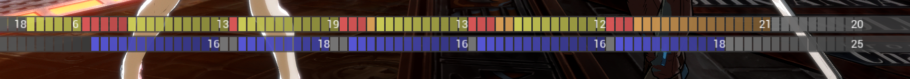

# Strive Frame Viewer

This is a fork of Ryn's Advantage viewer mod that allows you to see a SF6 style frame data display in training mode (and only training mode). You can view the mod at https://gamebanana.com/mods/483661.



## Installation
Download the Frame Viewer zip file from releases, and extract the contents into the win64 directory of GGST. If you are upgrading, delete the existing "cache" folder as it can cause issues if it is out of date.

e.g. ```C:\Program Files (x86)\Steam\steamapps\common\GUILTY GEAR STRIVE\RED\Binaries\Win64```

This does not require any pak mods installed via unverum.

## The view explained
Two bars along the bottom of the screen display a series of frames. The top bar corresponds to player one, the bottom bar to player two. The color of these frames indicates different states that the respective player is in.
- <span style="color:gray">Gray</span>: the player is idle 
- <span style="color:blue">Blue</span>: the player is block stunned
- <span style="color:green">Green</span>: the player is hit stunned
- <span style="color:yellow">Yellow</span>: the player is in an animation
- <span style="color:red">Red</span>: the player has active hurtboxes
- <span style="color:orange">Orange</span>: the player is in a recovery animation
- <span style="color:red">Red Outline</span>: the player has a projectile with active hurtboxes

If the training mode reset is triggered or both players don't input a move for 20 frames, the combo is considered "ended" and the display will reset on the next input move.

Additionally, there are some space saving features. If a segment of frames is longer than 5 frames, the total length will be displayed as text. If an animation is in hitstun or counterhit stun, where animation is freezed, the frames will be dropped to save space. If both players have been in the same state for more than 10 frames, the segments will be "truncated" to save space. 

## Controls
- F1: Toggle Frame bar
- F2: Toggle Hitboxes
- F3: Pause/Resume the game
- F4: Advance the game by one frame (if paused)
- F5: Open mod menu

## TODO:
- Display hitboxes
- Fix Leo backstance move lengths
- Add data about largest gap for each player
- Save options between game sessions
- Some command throws don't show active frames
- RWA and BWA aren't counting for frames


## Disabling
The simplest way to disable this and any other ue4ss mods is to delete or remove the ```dwmapi.dll``` file from the game files. If this file is not present, the rest of the mod will not be loaded when the game is launched.

## Disclaimer
This is not a standard mod that extends or patches Unreal pak data, but instead relies on code injection. While it is designed to only provide functionality in training mode, it may violate TOS with Arc Systems. Using this may result in actions against your account on their part.

I make no guarantees on account standing, game stability, or the mental stability of the user after practicing perfect frame traps that may come as a result of this mod.

I advise disabling this mod (as detailed above) and restarting the game before playing online.

## Compiling from source
Start by downloading the project, you will need a github account with permissions to download the Unreal repository to do so (see the dependent UE4SS repository for instructions on this)
With either method, you may need to first manually run ```git submodule update --init --recursive``` on the RE-U4SS submodule.
### Auto Build
Requires powershell 7.4.1 or newer and MSVC build tools
The project can be built automatically using ```Scripts/build_project.ps1```.
Then you can run any of the package_*.ps1 or deploy_*.ps1 scripts in the same folder.
- The package_*.ps1 scripts will only create the unverum or standalone file structure in the Packages folder. Afterwords they can be manually installed.
- The deploy_*.ps1 scripts can be modified to point at your game/unverum install. They will automatically clean the target, build the package, and install the mod.

### Manual Build
1. Navigate to ```RE-UE4SS/VS_Solution``` and run ```generate_vs_solution.bat```
2. Open the solution ```Output/UE4SSMods.sln``` in MSVC (I use 2022)
3. Build all
4. There will be several files you need to copy to the game files
    1. ```Output/Output/<build>/UE4SS/bin/UE4SS.dll``` to ```Win64/```
    2. ```Output/Output/<build>/bin/proxy/bin/dwmapi.dll``` to ```Win64/```
    3. ```Output/StriveFrameData/<build>/StriveFrameData.dll``` to ```Win64/Mods/StriveFrameData/dlls/```